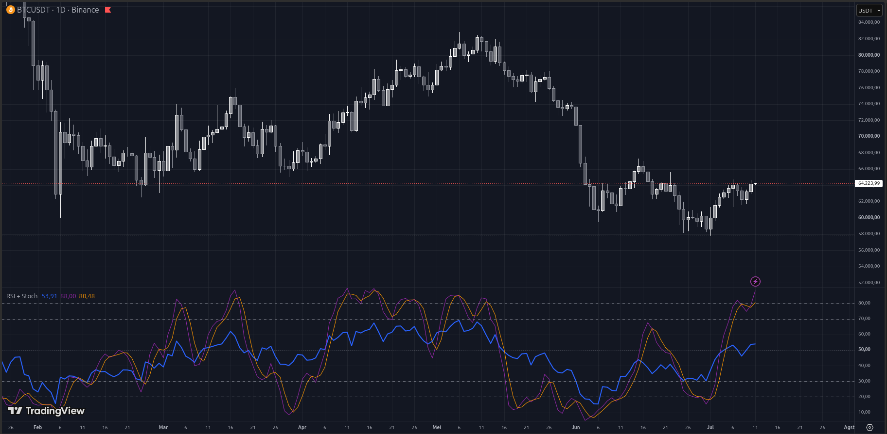

# RSI + Stochastic

**RSI + Stochastic** is a combination technical indicator for TradingView built with **Pine Script v6**. This indicator merges the *Relative Strength Index* (RSI) and the *Stochastic Oscillator* into a single pane to help traders identify overbought and oversold conditions with higher precision.

By combining these two popular oscillators, traders can monitor momentum confirmation (RSI) alongside the speed of price changes (Stochastic) within a single, clean, and efficient visual display.

---

---

## Key Features

* **Dual Oscillator Analysis:** Plots RSI (Relative Strength Index) and Stochastic (%K and %D) simultaneously for easy divergence or momentum confirmation.
* **Double Overbought/Oversold Levels:** Provides two customizable sets of boundary levels (OB/OS), allowing you to monitor both early "warning" zones and "extreme" reversal zones.
* **Configurable Smoothing:** Fully adjustable lengths for RSI and Stochastic parameters (%K, %D, and Smoothing) to perfectly suit various trading styles (Scalping, Day Trading, or Swing Trading).
* **Clean Visualization:** Uses distinct color coding for each line to keep your oscillator panel highly scannable and easy to read.

---

## Visual Elements & Chart Legend

The indicator utilizes a clean visual system designed to keep your chart analysis efficient:

| Abbreviation / Element | Meaning | Visual Style | Default Color |
| :--- | :--- | :--- | :--- |
| **RSI Line** | Relative Strength Index | Thick Line | Blue |
| **Stoch %K** | Stochastic %K Line | Thin Line | Purple |
| **Stoch %D** | Stochastic %D (Signal Line) | Thin Line | Orange |
| **OB Level 1/2** | Overbought Levels | Dashed Horizontal | Gray |
| **OS Level 1/2** | Oversold Levels | Dashed Horizontal | Gray |
| **Mid Line** | 50 (Neutral Zone) | Dotted Horizontal | Gray (50% Opacity) |

---

## How to Install on TradingView

1. Copy the entire code from your `.pine` script file.
2. Open **TradingView** and load any chart.
3. At the bottom of the screen, click on the **Pine Editor** tab.
4. Clear any default code in the editor and *paste* this indicator's script.
5. Click the **Save** button and give your script a name (e.g., "RSI + Stoch Combined").
6. Click **Add to chart** to view the indicator rendered live below your price chart.

---

## Disclaimer

*This indicator is developed purely for technical analysis, visual assistance, and quantitative research purposes. The use of oscillators like RSI and Stochastic does not guarantee 100% accurate price movements. Always apply strict risk management, use stop-losses, and consider overall market conditions before making any trading decisions.*
